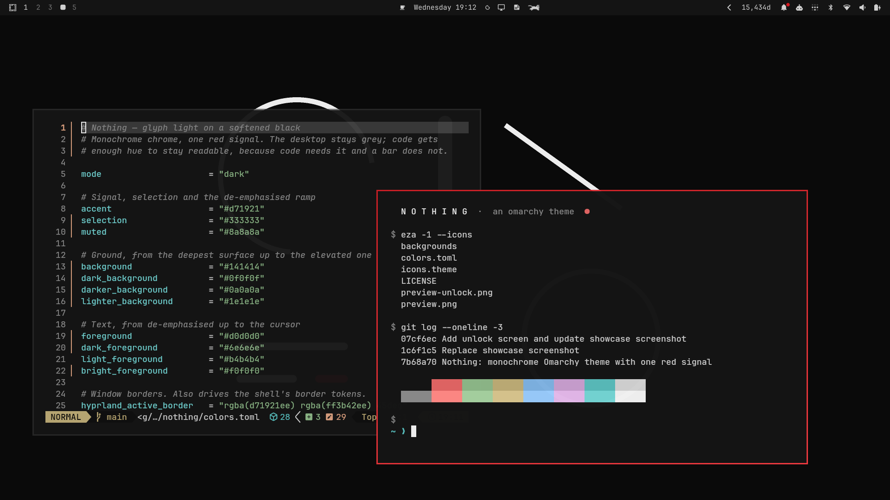

# Nothing

Monochrome ground, one red signal, dot-matrix surfaces.



An [Omarchy](https://omarchy.org/) theme after Nothing's design language.

## Install

```bash
omarchy theme install https://github.com/lookiyam-94/omarchy-nothing-theme.git
omarchy theme set nothing
```

## Idea

Nothing's hardware is transparent shell over black, with white glyph LEDs and a
single red accent used sparingly — a record dot, a power key. The theme follows
that discipline where the discipline belongs: the desktop chrome. Bar, borders,
menus and surfaces stay grey, and red (`#d71921`) is spent on one thing — the
focused window.

Inside a terminal or an editor it gives way, because code is not a bar. Syntax
carries as much hue as it needs to stay scannable.

## Palette

| Role | Hex | Notes |
|---|---|---|
| `background` | `#141414` | Softened black — 11.9:1 under the text |
| `darker_background` | `#0a0a0a` | Deepest surface |
| `foreground` | `#d0d0d0` | Off-white, not glyph-white |
| `accent` | `#d71921` | Nothing red |
| `bright_red` | `#ff3b42` | The active-border gradient's far stop |
| `selection` | `#333333` | Neutral grey — selection never tints |

Active window border is a 45° gradient `#d71921 → #ff3b42`. Inactive borders drop
to `#333333` so only one window is ever lit.

### On contrast

An earlier version ran `#0a0a0a` under `#ededed` — 16.9:1. It photographed well
and was tiring to work in; near-white on near-black is the classic recipe for
halation. The ground now sits at 11.9:1, level with Catppuccin and Kanagawa
(11.3:1), both of which people use for whole working days.

### ANSI colours

The six syntax hues are spaced evenly around LCh at `L=70 C=30`, which gives a
mean ΔE of 44 between them — comparable to Gruvbox (44) — with the closest pair
at ΔE 19, so no two token types collapse into each other. Every one clears 8:1 on
the background. They stay low-chroma, so a screen of prose still reads grey; a
screen of code does not.

Red is the exception in the other direction: kept darker and more chromatic
(`#e06463`, 5.4:1) so an error looks like an error rather than a pink.

## Backgrounds

Twelve, generated rather than photographed, in Nothing's own geometric idiom.
All 3840x2400, flat vector-style art — the whole set is about 1 MB.

| File | |
|---|---|
| `01-dot-matrix.png` | Uniform dot grid with one red dot off-centre |
| `02-glyph.png` | Phone (1) light-strip arrangement |
| `03-dot-gradient.png` | Halftone bloom, transparent-shell feel |
| `04-red-dot.png` | Pure black, one red dot |
| `05-rings.png` | Concentric dot rings, camera motif |
| `06-coil.png` | Wireless-charging coil with lead-out trace |
| `07-sphere.png` | Halftone-shaded orb |
| `08-dot-type.png` | NOTHING set in a 5x7 dot matrix |
| `09-sequence.png` | Glyph composer light bars, one struck red |
| `10-exposed.png` | The transparent back as schematic |
| `11-diagonal.png` | Dot rulings on the bias, one red |
| `12-horizon.png` | Halftone density falling to a hard red rule |

Cycle with `omarchy theme bg next`, or pick one from `omarchy theme bg-switcher`.
Files are numbered because Omarchy sorts them lexically.

Extra backgrounds of your own go in `~/.config/omarchy/backgrounds/nothing/` —
they join the rotation without touching the theme.

## Unlock screen

`unlock.png` is a transparent dot-matrix wordmark, with the red dot as the
period. It styles the Plymouth boot splash and the unlock screen, and puts the
theme under _Style > Unlock_ in the Omarchy menu:

```bash
omarchy plymouth set by theme nothing
```

`preview-unlock.png` is the accompanying preview, generated with
`omarchy plymouth preview`.

## Notes

- Pairs well with a dot-matrix display font (Nothing ships NType82 / Ndot).
  None is installed here; `omarchy font list` shows what is.
- Red as menu `selected-text` sits at 3.8:1. If selected rows read dim, copy the
  generated `shell.toml` from `~/.local/state/omarchy/current/theme/` into this
  directory and set `selected-text` to `#ff3b42`.
